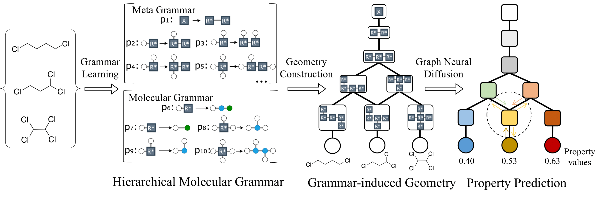

# Hierarchical Grammar-Induced Geometry for Data-Efficient Molecular Property Prediction
This repository contains the implementation code for paper [Hierarchical Grammar-Induced Geometry for Data-Efficient Molecular Property Prediction](https://proceedings.mlr.press/v202/guo23h/guo23h.pdf) (__ICML 2023__).

In this work, we propose a data-efficient property predictor (__Geo-DEG__) by utilizing a learnable hierarchical molecular grammar that can generate molecules from grammar production rules. Such a grammar induces an explicit geometry of the space of molecular graphs, which provides an informative prior on molecular structural similarity. The property prediction is performed using graph neural diffusion over the grammar-induced geometry. On both small and large datasets, our evaluation shows that this approach outperforms a wide spectrum of baselines, including supervised and pre-trained graph neural networks. 



## Installation

### Prerequisites
- __Pretrained GNN:__ We use [this codebase](https://github.com/snap-stanford/pretrain-gnns) for the pretrained GNN used in our paper. The necessary code & pretrained models are built in the current repo.

- __datasets:__ Download datasets and meta-geometry from [this link](https://drive.google.com/file/d/1cvLiZSzJnbja0xv4aaLQDNZe9RAhGP1a/view?usp=sharing).


### Install Prerequisites
Install the dependencies for Geo-DDEG following:
```bash
conda create -n Geo_DEG python=3.6
conda activate Geo_DEG
conda install scipy==1.2.1 pandas==0.23.4 numpy==1.16.2 scikit-learn
conda install pytorch torchvision torchaudio cpuonly -c pytorch
conda install -c rdkit rdkit
pip install ogb pykeops
pip install torchdiffeq -f https://pytorch-geometric.com/whl/torch-1.10.1+cpu.html
pip install torch-scatter torch-sparse -f https://data.pyg.org/whl/torch-1.10.0+cpu.html
pip install torch-geometric
pip install torch-cluster torch-spline-conv -f https://data.pyg.org/whl/torch-1.10.0+cpu.html
pip install setproctitle
pip install graphviz
pip install matplotlib
pip install typed-argument-parser
pip install tensorboardX
pip install hyperopt
```

## Train

## Training with MPN
```bash
cd GrammarDAG
python main.py --dataset crow_smiles_and_Tg_celsius.txt --feat_arch MPN --motif motif --adam
```

## Training with GNN
```bash
cd GrammarDAG
python main.py --dataset crow_smiles_and_Tg_celsius.txt --feat_arch GNN --motif motif
```


## Acknowledgements
The implementation of Geo-DEG is heavily based on [Data-Efficient Graph Grammar Learning for Molecular Generation](https://github.com/gmh14/data_efficient_grammar), partly based on [Molecular Optimization Using Molecular Hypergraph Grammar](https://github.com/ibm-research-tokyo/graph_grammar) and [Hierarchical Generation of Molecular Graphs using Structural Motifs](https://github.com/wengong-jin/hgraph2graph).


## Citation
If you find the idea or code useful for your research, please cite [our paper](https://proceedings.mlr.press/v202/guo23h/guo23h.pdf):
```bib
@article{guo2023hierarchical,
  title={Hierarchical Grammar-Induced Geometry for Data-Efficient Molecular Property Prediction},
  author={Guo, Minghao and Thost, Veronika and Song, Samuel W and Balachandran, Adithya and Das, Payel and Chen, Jie and Matusik, Wojciech},
  year={2023}
}
```


## Contact
Please contact guomh2014@gmail.com if you have any questions. Enjoy!